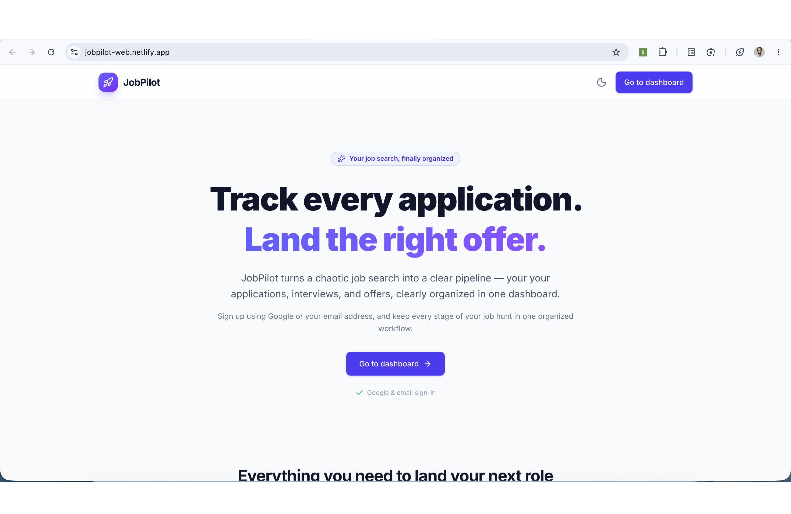
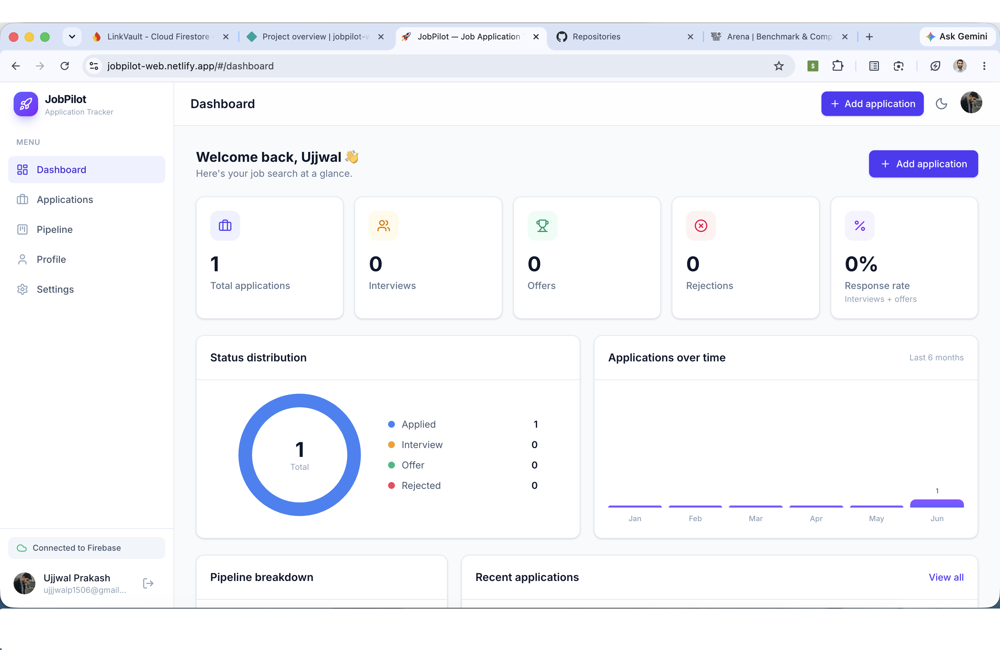

# 🚀 JobPilot

JobPilot is a modern job application tracking platform built with React, Firebase, Vite, and Tailwind CSS.

Track applications, manage interviews, organize opportunities, and monitor your job search progress through a clean, responsive, and intuitive dashboard.

## 🌐 Live Demo

**Live App:** https://jobpilot-web.netlify.app

## 📸 Screenshots

### Landing Page


### Authentication


### Dashboard


### Pipeline


---

## ✨ Features

* 🔐 Email & Password Authentication
* 🔑 Google Sign-In
* 🔄 Password Reset Support
* 💼 Create, Update & Delete Applications
* 📌 Pipeline Board for Application Tracking
* 🔍 Search, Filter & Sort Applications
* 📊 Dashboard Analytics & Statistics
* 🌙 Dark / Light Theme
* 📱 Fully Responsive Design
* ☁️ Firebase Authentication & Cloud Firestore

---

🛠 Tech Stack

* React
* Vite
* Tailwind CSS
* React Router
* Firebase Authentication
* Cloud Firestore
* Context API
* Lucide React

---

## 🚀 Local Setup

```bash
git clone https://github.com/Ujjwallp/JobPilot_Web.git

cd JobPilot

npm install

npm run dev
```

---

## 🔥 Environment Variables

Create a `.env.local` file:

```env
VITE_FIREBASE_API_KEY=
VITE_FIREBASE_AUTH_DOMAIN=
VITE_FIREBASE_PROJECT_ID=
VITE_FIREBASE_STORAGE_BUCKET=
VITE_FIREBASE_MESSAGING_SENDER_ID=
VITE_FIREBASE_APP_ID=
```

---

## 📦 Build

```bash
npm run build
```

---

## 👨‍💻 Developer

**Ujjwal Prakash**

GitHub: https://github.com/Ujjwallp