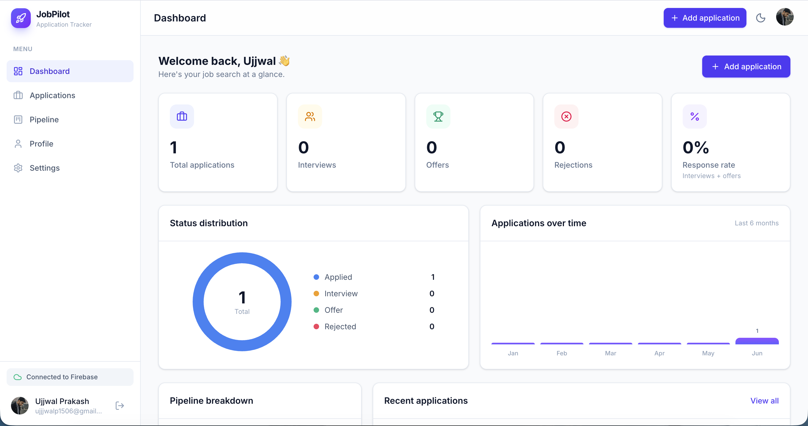
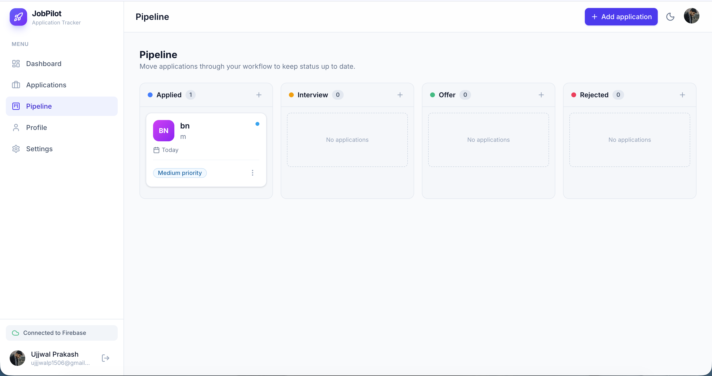
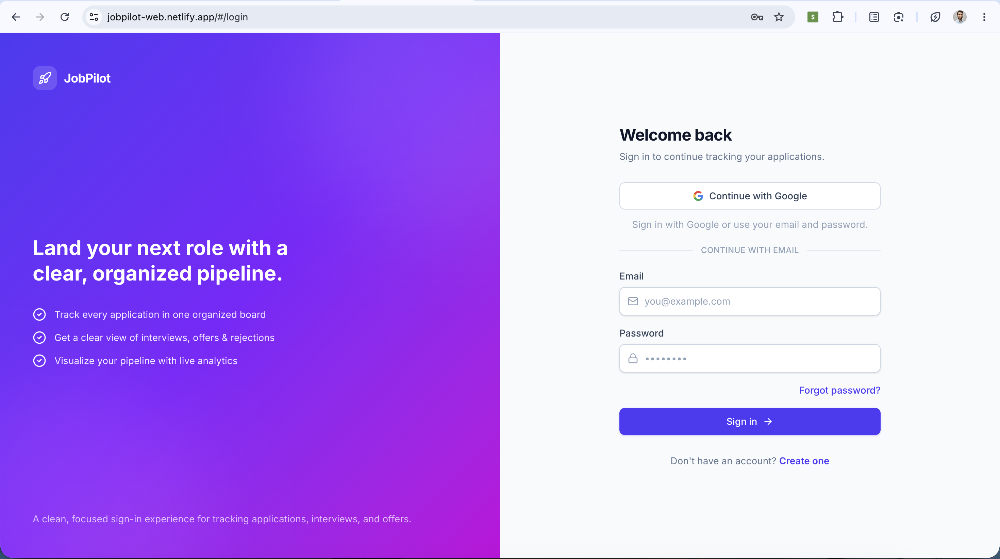

# 🚀 JobPilot – Modern Job Application Tracking Platform

[](https://react.dev)
[](https://vitejs.dev)
[](https://tailwindcss.com)
[](https://firebase.google.com)
[](https://github.com/Ujjwallp/JobPilot_Web/pulls)

JobPilot is a production-grade, highly-responsive job application tracking platform. It empowers candidates to manage, organize, and optimize their job search workflow through a gorgeous, interactive dashboard, Kanban pipeline, and advanced analytics.

---

## 🌐 Live Demo

**Live App:** [https://jobpilot-web.netlify.app](https://jobpilot-web.netlify.app)

---

## 📸 Interactive System Tour

### Landing Portal


### Analytics Dashboard


### Kanban Pipeline Board


### Unified Authentication Shell


---

## ✨ Features

* **📊 Real-time Dashboard & Analytics:** Dynamic statistics showing total applications, pending interviews, offer rates, and status distributions utilizing modern SVG charts.
* **📌 Drag-and-Drop Kanban Board:** Beautiful and intuitive pipeline view to easily transition jobs from *Applied* to *Interviewing*, *Offered*, or *Rejected*.
* **🔐 Multi-Method Authentication:** Secured using Firebase Auth, offering standard Email & Password registration/login and one-click Google Sign-in.
* **🔍 Search, Filter & Sorting Engine:** Advanced real-time search, sorting by priority or date, and status filtering.
* **🌙 Dark / Light Theme Sync:** Fully styled responsive design with automatic and manual mode options to prevent eye strain.
* **📱 Fully Mobile Responsive:** Designed with mobile-first CSS using Tailwind CSS v4, perfectly rendering on desktop, tablet, and mobile displays.

---

## ⚙️ Architecture & Tech Stack

* **Frontend Framework:** React 19 (Hooks, Context API)
* **Build System:** Vite 7 (configured for optimized delivery)
* **Styling Engine:** Tailwind CSS v4 (with `clsx` and `tailwind-merge`)
* **Backend Database:** Cloud Firestore (real-time listeners and transactional updates)
* **Auth System:** Firebase Authentication SDK
* **Icons:** Lucide React

---

## 📂 Project Structure

```text
src/
├── components/
│   ├── dashboard/           # Dashboard specific widgets (StatCard)
│   ├── jobs/                # Job tracking representations (JobCard, JobForm, JobModal)
│   ├── layout/              # Navbars, Sidebars, AuthShell, and page layout architecture
│   └── ui/                  # Reusable low-level UI elements (Buttons, Inputs, Modals)
├── constants/               # Global configuration tables and enums
├── contexts/                # React Context Providers (Auth, Jobs, Toast, Theme)
├── hooks/                   # Custom hooks decoupling UI from business logic
├── pages/                   # Main page containers (Dashboard, Kanban, Settings, Profile)
├── services/                # Firebase instance initializer and database services
├── styles/                  # Global CSS and Tailwind directives
└── utils/                   # Reusable utility functions and formatting helpers
```

---

## 🚀 Installation & Local Development

### 1. Prerequisites
- Node.js 20+
- npm or yarn
- Firebase account

### 2. Clone & Install Dependencies

```bash
git clone https://github.com/Ujjwallp/JobPilot_Web.git
cd JobPilot_Web
npm install
```

### 3. Configure Environment Variables

Create a `.env.local` file in the root directory and append your Firebase credentials:

```env
VITE_FIREBASE_API_KEY=your_firebase_api_key
VITE_FIREBASE_AUTH_DOMAIN=your_firebase_auth_domain
VITE_FIREBASE_PROJECT_ID=your_firebase_project_id
VITE_FIREBASE_STORAGE_BUCKET=your_firebase_storage_bucket
VITE_FIREBASE_MESSAGING_SENDER_ID=your_firebase_messaging_sender_id
VITE_FIREBASE_APP_ID=your_firebase_app_id
```

### 4. Run Development Server

```bash
npm run dev
```

---

## 📦 Production Bundling

Optimize and compile files for deployment:

```bash
npm run build
```

To preview the built site locally:

```bash
npm run preview
```

---

## 🌐 Deployment Instructions

### Vercel
1. Install [Vercel CLI](https://vercel.com/cli) or import directly via the Vercel dashboard.
2. Link your GitHub repository.
3. Configure the environment variables in the project settings matching `.env.local`.
4. Deploy with `vercel --prod`.

### Netlify
1. Log into your Netlify dashboard and click **Add new site**.
2. Select your repository.
3. Set the build command to `npm run build` and publish directory to `dist`.
4. Add environment variables in **Site settings > Environment variables**.
5. Click **Deploy site**.

---

## 👨‍💻 Author

**Ujjwal Prakash**
* **Portfolio / GitHub:** [https://github.com/Ujjwallp](https://github.com/Ujjwallp)
* Designed & Developed by Ujjwal Prakash